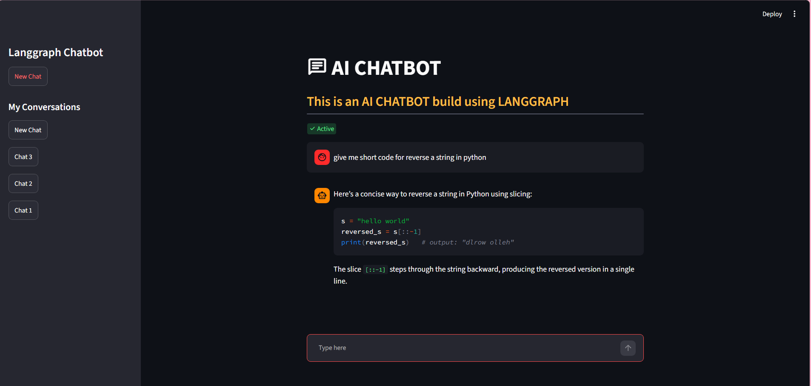
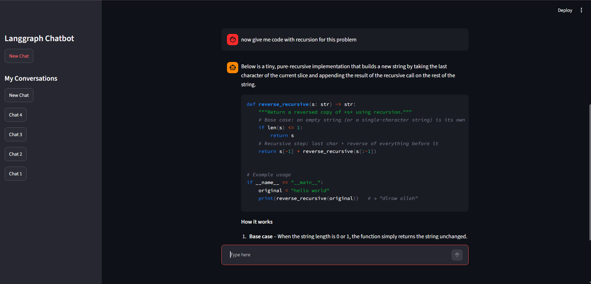

# LangGraph Chatbot

This project is a simple chatbot app built with Python, LangGraph, and Streamlit. It uses a LangGraph state graph with a SQLite checkpointer so conversations can be stored and resumed across threads.

## Features

- Chat interface built with Streamlit
- LangGraph-based workflow for message processing
- SQLite-backed conversation checkpointing
- Multi-thread chat support
- New chat creation and conversation switching in the sidebar

## Project Structure

- `langgraph_database_bakend.py` – backend LangGraph graph and database setup
- `streamlit_frontend_database.py` – Streamlit frontend UI
- `chatbot.db` – SQLite database for checkpointing
- `.env` – environment variables such as the Groq API key

## Requirements

- Python 3.10+
- A Groq API key
- Virtual environment recommended

## Setup

1. Create and activate a virtual environment:

```bash
python -m venv myenv
myenv\Scripts\activate
```

2. Install dependencies:

```bash
pip install -r requirements.txt
```

3. Create a `.env` file in the project root with your Groq key:

```env
GROQ_API_KEY=your_api_key_here
```

## Run the app

```bash
streamlit run streamlit_frontend_database.py
```

## App Preview

Save the screenshot as `assets/chatbot-demo.png` and it will appear below automatically.



## Memory and Thread View

This project keeps chat state per thread using LangGraph checkpoints and SQLite. The sidebar allows users to switch between saved conversations and continue from the same memory context.

Save the second screenshot as `assets/chatbot-memory.png` to show the thread history and memory flow.



## Notes

- The app stores chat checkpoints in the SQLite database file `chatbot.db`.
- The virtual environment folder should be ignored by Git via the `.gitignore` file.
- If you want to stop using a conversation thread, you can create a new one from the sidebar.

## Future Improvements

- Better chat thread naming from the first user message
- Conversation delete/edit actions
- More polished Streamlit UI
- Persistent user authentication or session management
